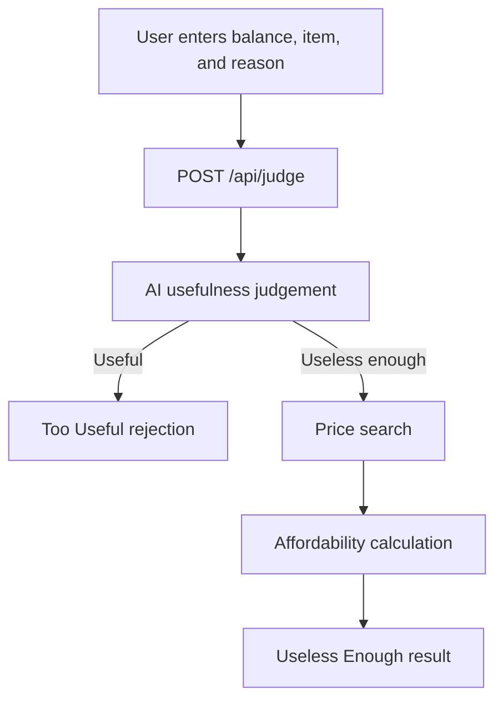

# Can I Afford This?


# DUMBBUY 🎯


## Basic Details
### Team Name: The Ninth Delusion


### Team Members
- Team Lead: Fatima Sana Issahac - SSET
- Member 2: Ilham Nadhir - SSET


### Project Description
Can I Afford This? is a satirical AI-powered purchase judge for questionable shopping decisions.
Enter a bank balance, an item, and a justification. The app decides whether the purchase is too useful
to be accepted or useless enough to deserve a price and affordability breakdown.

### The Problem (that doesn't exist)
People are constantly buying sensible things without first checking whether their purchase is sufficiently
unnecessary. This app solves the completely imaginary crisis of responsible spending.

### The Solution (that nobody asked for)
An AI anti-financial-advice engine evaluates the item's usefulness and the user's excuse. Sensible items
are rejected for being too practical. Useless items are priced, scored, and converted into a dramatic
calculation of how many could be bought before the balance disappears.

## Technical Details

### Technologies/Components Used
For Software:
- Languages: TypeScript, JSX, CSS
- Frameworks: Next.js 14, React 18, Tailwind CSS
- Libraries: OpenAI SDK, Google Generative AI SDK, Lucide React, canvas-confetti, clsx, tailwind-merge
- Tools: Node.js, npm, Vercel-compatible Next.js API routes

## Implementation

### Installation
```bash
npm install
```

### Run
```bash
npm run dev
```

Open [http://localhost:3000](http://localhost:3000) in a browser.

For a production build:

```bash
npm run build
npm start
```

The app accepts an OpenAI or Gemini API key through the settings dialog. For a server-side default,
configure `OPENAI_API_KEY` or `GEMINI_API_KEY` in the deployment environment. Do not expose these keys
with a `NEXT_PUBLIC_` prefix.

## Project Documentation

### Screenshots
Add these screenshots before submitting the project documentation:

- 
: The purchase form with balance, currency, item, and reason fields.

- 
: The rejection result for a sensible purchase.

- 
: The price, uselessness score, and affordability result.

### Workflow Diagram


This is a software-only project, so hardware schematics and build photos are not applicable.

### Project Demo
#### Video
[Add demo video link]

The demo should show entering a purchase, receiving an AI verdict, and viewing the affordability result.

#### Additional Demos
[Add the deployed Vercel URL or other demo materials]

## Team Contributions
- Fatima Sana Issahac: AI judgement, price search, and affordability logic.
- Ilham Nadhir: Testing, deployment, documentation, and demo production.

---

Made for TinkerHub Useless Projects.


